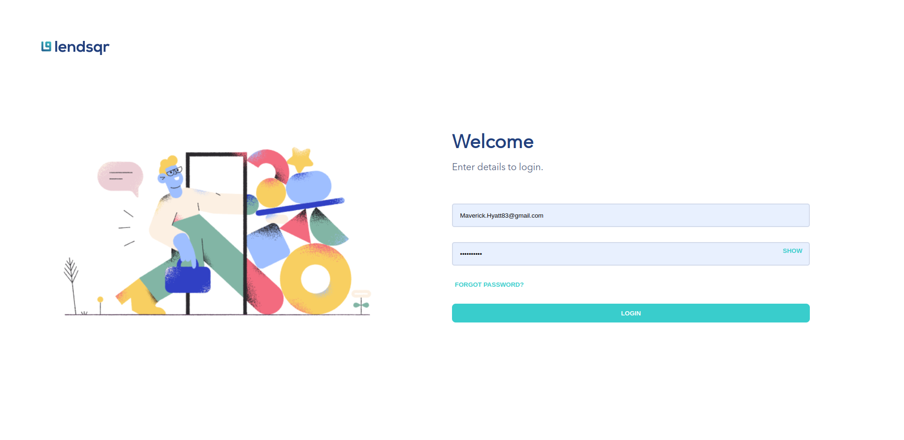
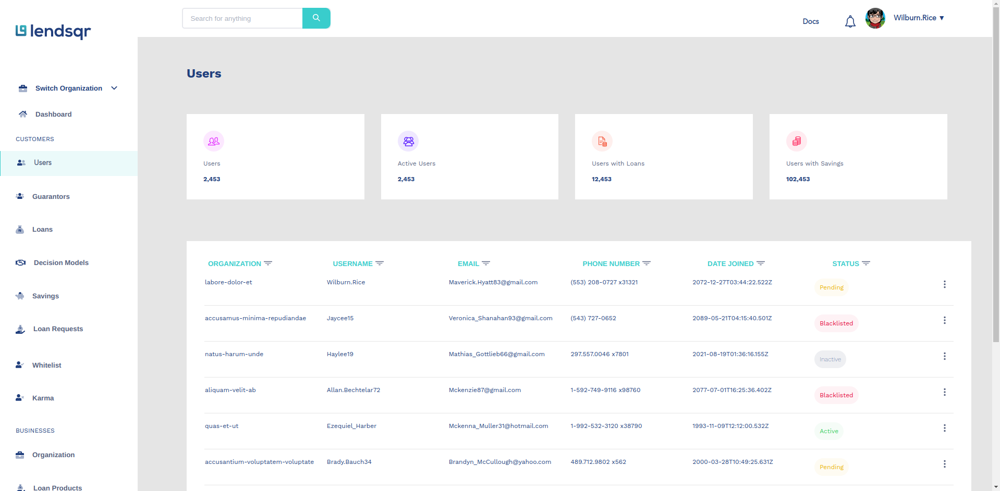
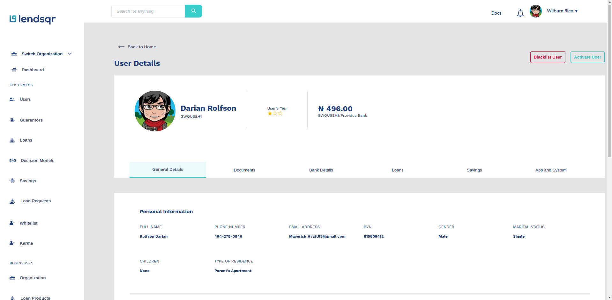
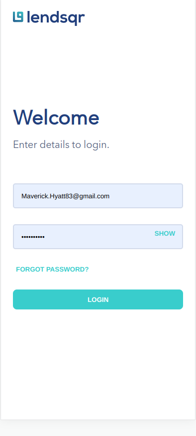
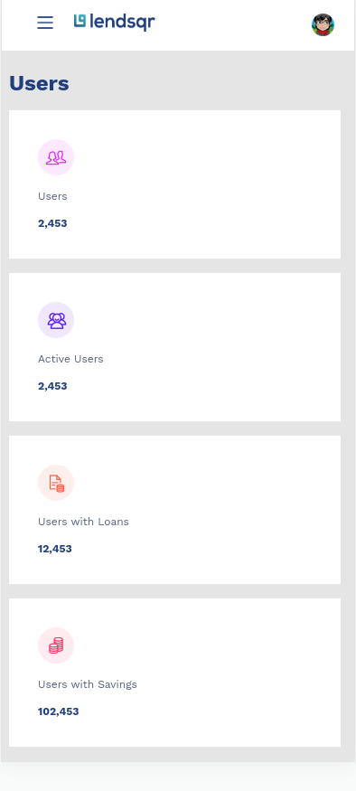
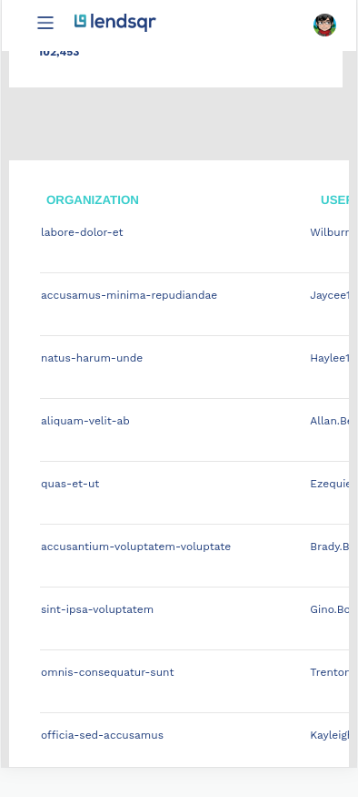
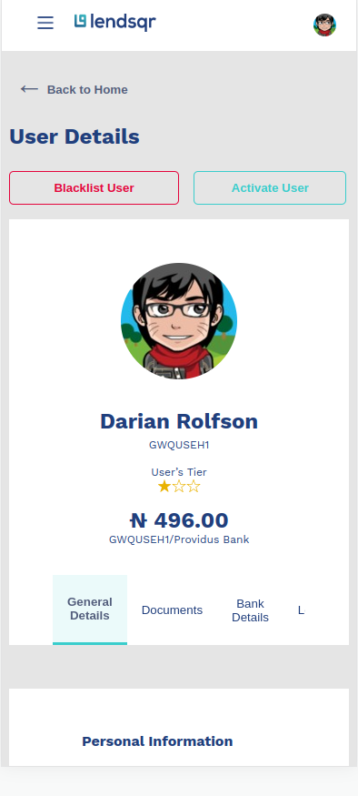

# Lendsqr Frontend Engineer Assessment

This repository contains the solution for the Lendsqr Frontend Engineering Candidate Test. The test assesses the candidate's ability to build a web application using React with TypeScript and SCSS, while adhering to design specifications and best practices.

## Tools used

-   React
-   Typescript
-   Cypress

## Resources

-   [Figma Design](https://www.figma.com/file/ZKILoCoIoy1IESdBpq3GNC/FrontendTesting?node-id=5530%3A0)
-   [Hosted on Vercel]()

## How to run the project

-   Run `bash npm i -g yarn `
-   Run `bash yarn install `
-   Run `bash yarn dev `
-   To run tests for the project, run `bash yarn ci `

## Screenshots

-   ### Desktop Views

    
    
    

-   ### Mobile Views
    
    
    
    

## Appreciation

Thank you for taking the time to review my frontend engineering project for Lendsqr. It has been an exciting and rewarding experience to work on this assessment, and I believe it showcases my skills, dedication, and passion for frontend development.

Throughout the project, I have strived for visual fidelity, adhering closely to the provided Figma design. I have meticulously crafted each page, ensuring pixel-perfect representation and a seamless user experience. The codebase is well-structured, following best practices and utilizing modern technologies such as React with TypeScript and SCSS.

I have demonstrated my ability to integrate with a mock API, fetching user data and displaying it accurately on the User and User Details pages. By leveraging local storage, I have implemented a persistent storage solution to store and retrieve user details efficiently.

During the development process, I have paid careful attention to code quality, employing clean and maintainable coding practices. Unit testing has been an integral part of my approach, covering positive and negative scenarios to ensure robust functionality.

Moreover, I have maintained a clear and concise commit history, providing detailed commit messages that outline the purpose and impact of each change. The GitHub repository is well-documented, featuring a comprehensive README.md file that provides an overview of the project, instructions, and any necessary information.

As a frontend engineer, I understand the importance of responsive design, and I have ensured that the application adapts seamlessly to different screen sizes and media types. The project has been deployed on Vercel, allowing easy access for review.

I am truly excited about the opportunity to join the Lendsqr team and contribute to its mission of connecting lenders with customers through innovative web applications. My skills, attention to detail, and commitment to excellence make me confident in my ability to thrive in a frontend engineering role at Lendsqr.

Thank you once again for considering my application. I look forward to the opportunity to discuss my project and qualifications further in an interview. Please feel free to reach out to me at your convenience. I am eagerly awaiting the chance to contribute my expertise and passion to the success of Lendsqr.